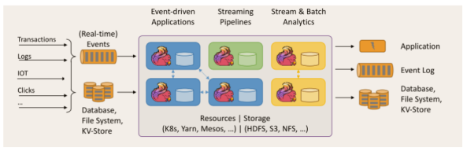
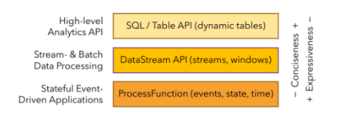
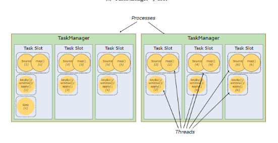
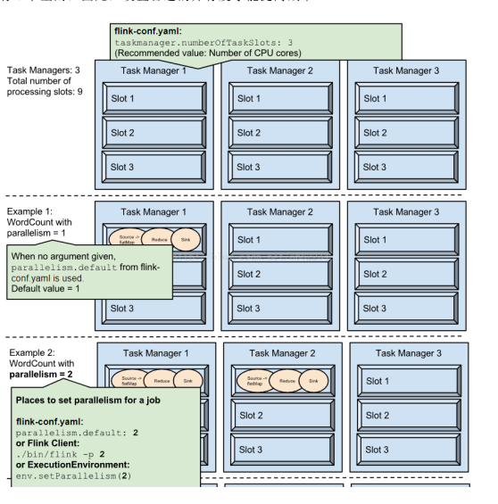
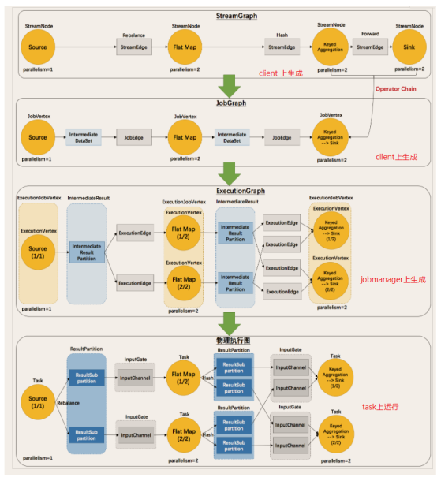
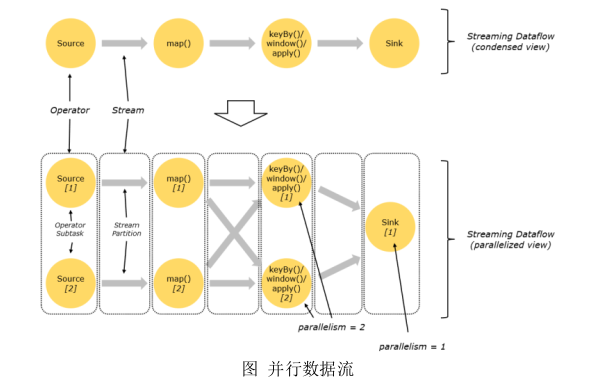

# 第一章 Flink 简介

## 1.1 初识Flink

​	Flink起源于Stratsphere项目，2014年12月，Flink成为Apache的顶级项目。

​	在德语中Flink一词代表快速和灵巧。

​	Flink的理念是**“Apache Flink是一个分布式、高性能、随时可用以及准确的流处理应用程序打造的开源流式处理框架”**。

​	Apache Flink 是一个框架和分布式计算引擎，用于对**有界和无界的数据进行有状态计算**。

​	Flink被设计在所有常见的集群中，以内存执行速度和任意规模来执行计算。

​	如上图中，数据来源可以是事实事件如Clicks、Iot等Real-time Events，或者以Logs、Clicks为主的Database、FileSystem、KVStore。

​	通过Flink可以构建：

 - 构建Event-driven的实时应用。

 - Streaming Pipelines的数据管道。

 - Streaming & Batch的实时分析。

   Flink的资源管理可以通过K8s、Yarn、Mesos。Flink的状态存储可以放在HDFS、S3、NFS 上。

## 1.2 Flink的重要特点

### 1.2.1事件驱动型

​	事件驱动是一类**有状态**的应用，从**一个或者多个**数据来源提取数据。并根据到来的事件触发计算、状态更新或其他外部动作。比如以kafka为代表的消息队列都是事件驱动型应用。

​	与之不同的就是Spark Streaming的微批：

​	batchs of input data。可以将数据从流转为批处理。

​	事件驱动型：

​	Event-driver中逐步ingest数据，然后**由于Flink是有状态的**，因此他的state是**周期性的、异步的带有检查点的写入到持久层中**，保证了有状态这一要求。同时如果有开窗等需求，会定期激活trigger方法，将数据进行计算。

### 1.2.2 流与批的世界观

​	批处理的特点是：**有界、大量、持久**的。非常适合需要访问全套记录才能完成工作，一般用于离线计算。

​	流处理的特点是：**无界、实时的**。无需对整个数据集进行计算，而是对通过系统的每个数据项进行操作，用于实时的统计。

​	对于Spark的世界观来说，一切都是由批次组成的，离线数据是一个大批次，实时数据是一个小批次。

​	对于Flink的世界观来说，一起都是由流组成的，离线数据是一个有界限的流，实时数据是一个无界限的流，也就是有界流与无界流。

​	**无界数据流**：无界数据流是一旦开始就没有结束的流，他们不会在生成时终止并提供数据，必须连续处理无界流，也就是在获取后**立即处理事件**。对于无界流无法等待数据全部到齐，因为数据是无界的，所以任何时间点都不会完成。

​	因此，处理无界数据流时候，对顺序（比如事件发生的时间）就特别重要，因为顺序意味着完整性。

​	**有界数据流**：有界数据流由于有明确的定义，可以在执行任何计算前通过获取所有的数据来处理有界流。这时候就可以做排序，因此有界流的处理也叫批处理。

### 1.2.3 分层api

- 最底层。提供了有状态流，通过过程函数（Process Function）被潜入到DataStream中。底层过程函数（Process Function）与DataStream API集成，使其可以对特定的某些操作进行底层的抽象。
- DataStram API，通过transformations、joins、aggregations、windows进行。
- Table API是以**表为中心的声明式编程**。TableAPi遵循关系性模型：表具有二维数据结构（schema）、同时Api提供可比较的操作，例如select、join、group by等语义，明确定义了什么逻辑应该执行，而不是说明如何执行。同时Table API支持UDF函数。我们可以在DataStream与TableAPi中来回切换。
- Flink最高级的抽象是SQL。这一层的语法与表达能力与Table API类似，但是可以通过SQL查询表达式的形式表现程序。SQL与TableAPi密切交互，SQL查询可以直接作用在Table API定义的表上。

其他的几个模块

- Flink CEP
- Flink Gelly
- Alink

# 第二章、快速上手

## 2.1、搭建maven工程

## 2.2、批处理的WordCount

## 2.3、流处理的WordCount

# 第三章 Flink部署

## 3.1、Standalone模式

## 3.2、Yarn模式

## 3.3、k8s部署

# 第四章 Flink的运行架构

## 4.1、Flink运行时的组件

​	Flink运行包括四个组件：作业管理器（Job Manager）、资源管理器（Resource Manager）、任务管理器(Task Manager)、分发器(Dispatcher)。所以所有的组件都是运行在java虚拟机上。

​	每个组件的**职责**如下：

 - 作业管理器（Job Manager）

   控制一个应用程序（Flink作业）的主进程，**每一个Flink作业会被一个Job Manager控制**。流程如下：

   1、Job Manager收到Flink作业，包括：作业图（JobGraph）、逻辑数据流图（logical dataflow graph）、打包了的类、库、其他jar包。

   2、Job Manager会将Job Graph转换为一个物理层面的数据流图，这个数据流图叫做“执行图”（Execution Graph）、包含了所有可以并发执行的任务。

   3、Job Manager会向资源管理器Resource Manager 请求任务所需要的资源（Slot）。

   4、当Job Manager获得了足够的资源，会将执行图发送到真正执行他们的Job Manager上。

   5、运行过程中，Job Manager负责所有需要中央协调的操作，比如检查点（check point）的协调。

   

 - 资源管理器（Resource Manger）

   主要负责任务管理器（Task Manager）的插槽（Slot）,Task Manager的Slot是Flink中定义的资源处理单元。Flink为不同的环境提供了不同的资源管理器（Resource Manager），如YARN、Mesos、K8s，以及Standalone部署方式。

   **当Job Manager申请资源的时候，Resource Manager 会将有空闲Slot的Task Manager分配给Job Manager**。如果Resource Manager没有足够的Slot来满足Job Manager的需求时候，它还可以向资源提供平台发起会话，以提供启动Task Manager进程的容器。

   

 - 任务管理器（Task Manager）

   **Flink中的工作进程**。通常在Flink中有多个TaskManager运行。每一个Task Manager都包含一个数量的slot。slot的数量限制了TaskManager能够执行的任务数量。

   1、启动后，Task Manager会向Resource Manager资源管理器注册它的插槽。

   2、收到资源管理器的指令后，TaskManager会将一个或者多个Slot提供给Job Manager调用。

   3、Job Manager就可以向Slot分配任务执行了。在执行过程中，Task Manager可以和其他Task Manager交换数据。

 - 分发器（Dispatcher）

   提供**web ui**，和restful的接口，用于启动并将应用移交job manager。

## 4.2、任务提交流程

### standalone模式下的流程

​	1、通过flink的web界面上传jar应用。

​	2、dispatcher启动Job Manager，并将jar应用提交给Job Manager。

​	3、Job Manager 向Resource Manager请求Slots。

​	4、Resource Manager启动Task Manager。

​	5、Resouce Manager注册slots。

​	6、发出提供slot的指令。

​	7、Task Manager提供给Job Manager slot。

​	8、Job Manager提交要在slots中执行的任务。

​	9、Task Manager交换数据。

## 4.3、任务调度原理

​	客户端将dataflow发送给Master(JobManager)。然后收到Job Manager定期返回的统计信息。

​	Flink集群启动后，启动一个Job Manager和一个或多个Task Manager。

​	client将任务提交给Job Manager。Job Manager调度到各个Task Manager去执行。Task Manager定期将心跳信息和统计信息返回给Job Manager。

​	Client为提交job的客户端。

​	Job Manager主要负责调度job 并协调Task做check point。从Client收到Job和JAR包等资源后，生成优化的执行计划，并将Task的单元调度给各个Task Manager执行。

​	Task Manager在启动的时候就设置好了Slot。每个Slot能启动一个Task。Task为线程，从Job Manager接受需要部署的Task，部署启动后，与自己上游的Netty链接，接收数据并处理。

### 4.3.1、TaskManager与Slots

​	每一个TaskManager都是一个**JVM进程**，它可能在独立的线程上执行一个subtask或多个subtask。为了控制一个worker能接受多少task，Task Manager通过task slot进行控制。

​	每个task slot表示Task Manager拥有的一个固定大小的子集。假如一个Task Manager有三个slot，那么它管理的**内存就会被分成三分给各个slot**。以此达到使用slot做到资源隔离、具备内存 储备的特性。**slot只能隔离task受管理的内存，不涉及cpu的隔离**。

​	一个Task Manager多个slot意味着更多的substask可以**共享同一个jvm**，在一个jvm进程中的task将共享tcp连接与心跳信息。

​		

​	Flink默认子任务共享slot，也就是如下图：

​	一个典型的source->map->keyBy & window & apply->sink中，source、map、keyby共享一个slot，这样一个slot可以保存作业的整个管道。

​	**Task Slot是静态的概念，指的是Task Manager的并发执行能力**，可以通过参数taskmanager.numberOfTaskSlots进行配置。

​	**并行度parallelism是动态概念，即Task Manager运行某一个作业时候实际的并发能力**。

​	

​	

### 4.3.2、程序与数据流（DataFlow）

​	**所有的Flink程序都由source、transformation、sink三个部分组成。**

​	运行的时候，Flink上运行的程序会被映射成为“逻辑数据流”（Dataflow），组成一个DAG图。

### 4.3.3、执行图（ExecutionGraph）

​	在Flink中程序的执行图分为四层：

	- StreamGraph。用户通过Stream API编写的最初的图。
	- JobGraph。Job Manager将StreamGraph优化后的JobGraph。优化点主要为：**将多个符合条件的节点chain成一个节点**。这样的目的是数据在节点中间流动的时候发生的序列化和反序列化过程。
	- ExecutionGraph。Job Manager根据JobGraph生成ExecutionGraph。是JobGraph的并行化版本，是调度层最核心的数据结构。
	- 物理执行图。Job Manager根据ExecutionGraph对Job进行调度后，在各个Task Manager上部署Task后形成的”图“

​	四个执行图的生成过程如下图：

	

### 4.3.4、并行度（Parallelism）

​	Flink程序的执行具有**并行、分布式**的特性。

​	一个流（stream）包含一个或多个分区（stream partition），而每一个算子（operator）可以包含一个或多个子任务（opertor subtask），这些子任务可以在**不同的线程、不同的容器或者物理机中**。

​	**一个特定的算子的子任务（subtask）的个数被称为其并行度（parallelism）**。一般情况下，一个流的并行度是所有算子中最大的并行度。一个程序中，不同的算子可能有不同的并行度，这个可以在api中设置。

​	

​	stream在算子之间的数据传输one-to-one(forwarding)、redistributing两种方式。

	- **one-to-one(forwarding)**。stream维护着分区和分区内元素的顺序。如source和stream之间，比如map、filter、flatMap等算子都是one-to-one的方式。
	- **redistributing**。stream的分区会发生改变。如keyBy/window和sink之间，keyBy算子的子任务会根据所选择的transformation发送数据到不同的目标任务。例如keyBy()基于hashCode重分区、broadcast和rebalance会随机重新分区，这些算子都是redistribute过程，类似于MR中的shuffle过程。

### 4.3.5、任务链（operator chains）

​	相同并行度的one-to-one操作，Flink会将这样的算子合并为一个task，这样能减少线程之间的切换和基于缓存区的数据交换。

