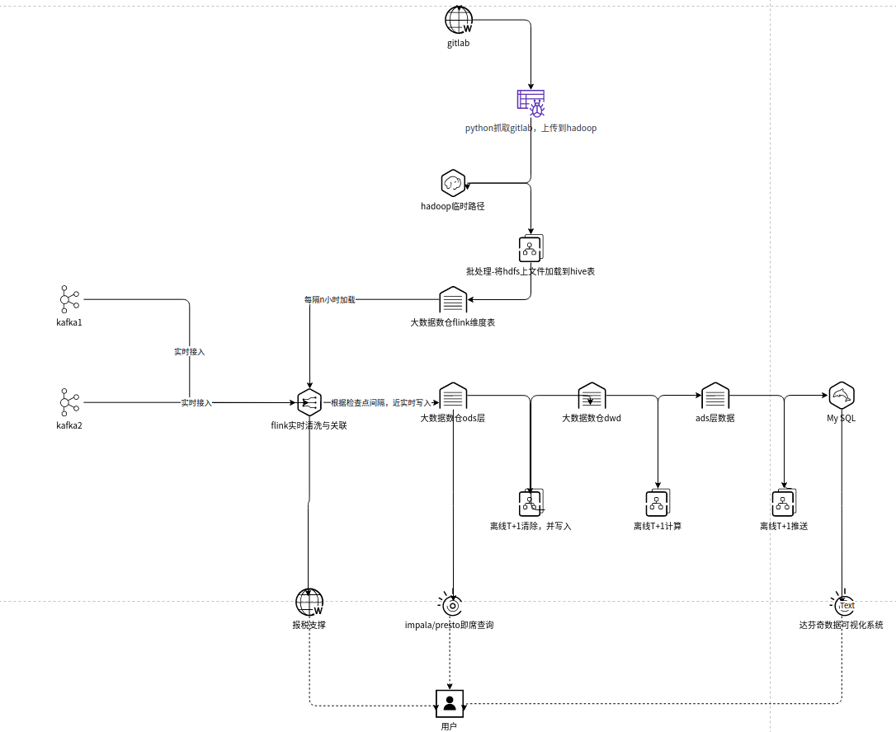

# 应用架构

整体架构：

分为如下4个模块：

## gitlab采集端
- 通过python抓取gitlab，并将数据存储到hadoop。每天运行1到2次。
  
  代码位置：[python脚本](http://xxxx.xxx.xxx/group_di/bigdata/fetch-git-info)完成，
  
  部署位置：1.2.3.4
  
- gitlab的hive维度表制作。将hadoop上的gitlab文件加载到hive表 flink_database.dim_git_info 。
  
  oozie schedule：[ods_git_info_d与dim_git_info的shedule](http://1.2.3.4:1/hue/oozie/editor/coordinator/edit?coordinator=80863)

  部署位置：腾讯云EMR。

- 实时流发送结果到报税支撑

  暂未开发

## 实时端

- 实时消费kafka1、kafka2的数据，每隔一定时间将 flink_database.dim_git_info 最新分区加载到内存中，与实时流关联。根据检查点间隔，将结果写入到大数据数仓ods层。
  
  代码位置：[flink的new-dz-java-log-analysis](http://1.2.3.4/group_di/bigdata/flink-job/tree/master/new-dz-java-log-analysis)

  部署位置：flink standalone集群。

## 离线端

- 每天清除三天前的ods层表，避免小文文件过多
  
  oozie schedule：[ods log_ods.ods_new_dz_java_log_all删除三天前分区schedule](http://1.2.3.4:13000/hue/oozie/editor/coordinator/edit?coordinator=80856)

  部署位置：腾讯云EMR。
  
- 将ods层写入到dwd层
  
  oozie schedule：[dwd dwd_new_dz_java_log_all_d_schedule](http://1.2.3.4:13000/hue/oozie/editor/coordinator/edit?coordinator=80376)

  部署位置：腾讯云EMR。

- 将dwd层写入到ads层，并将ads层推送到mysql数据
  
  oozie schedule：[ads ads_new_dz_java_log_schedule ](http://1.2.3.4:13000/hue/oozie/editor/coordinator/edit?coordinator=81468)

  部署位置：腾讯云EMR。

## 离线展示端

- 达芬奇

  [链接](http://1.2.3.4/#/xxx/xxx/portal/37/portalName/%E6%96%B0%E6%97%A5%E5%BF%97%E8%BF%BD%E8%B8%AA/dashboard/111)

注：

具体环境地址见代码中相关配置

