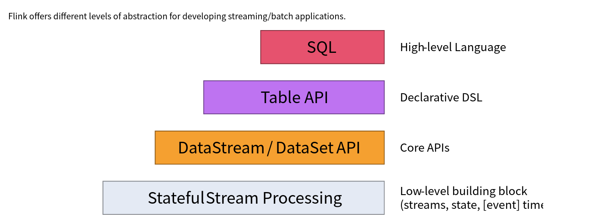
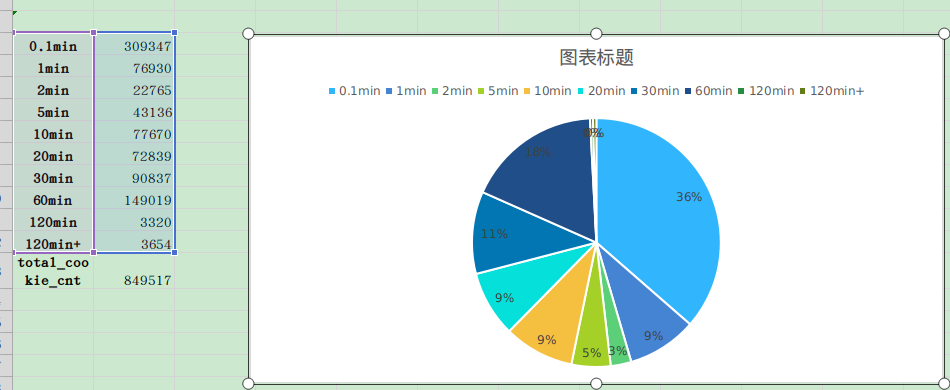
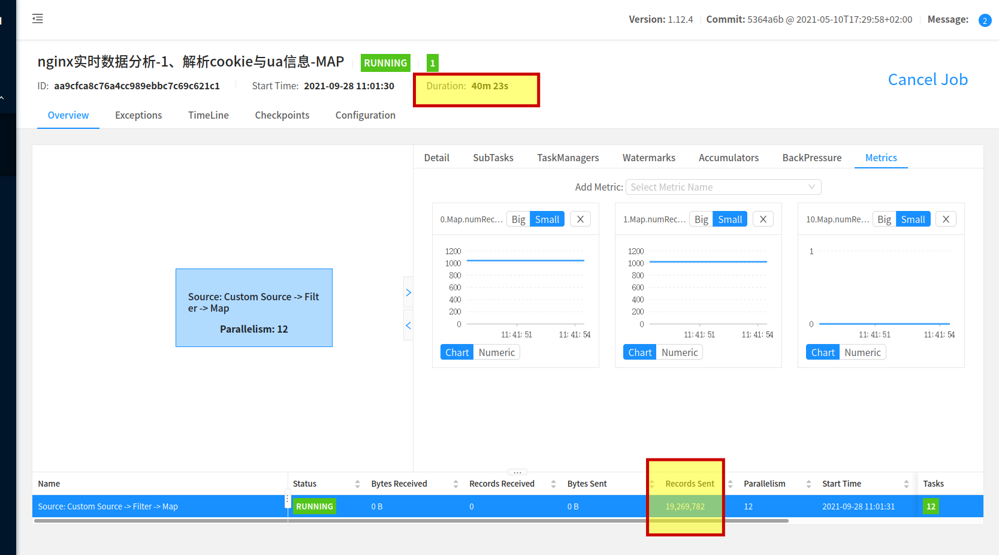
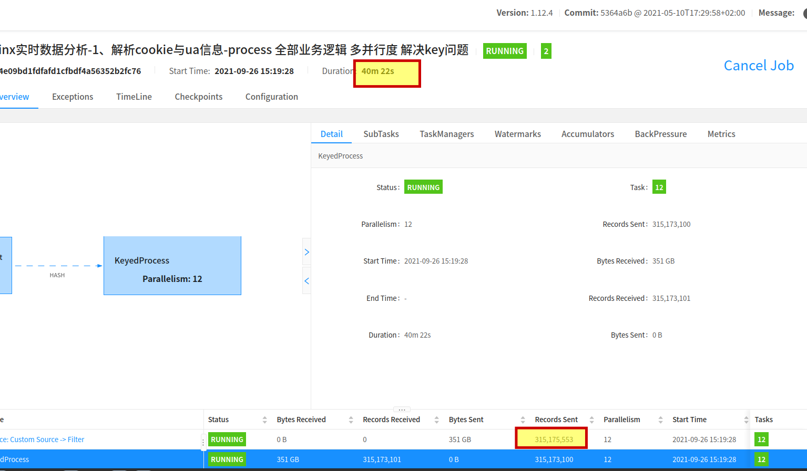

# 导语

Flink有三层api，大多数实时需求一般使用核心api，TableAPI即可解决，但是在某些场景上，只使用核心api、TableApi往往力不从心 。本文主要通过nginx实时解析这个例子，来讲一下如何通过底层API和状态后端的编程方式，替代Map算子的功能，将作业的吞托量提升至之前的16倍。

# 业务背景介绍


### 1、什么是nginx日志

目前绝大部分公司都会使用nginx做负载均衡。运维部门一般会通过FileBeat、ELK等工具可以将nginx处理的每个请求记录都采集下来，作为日志存储起来，用作后续的分析。

一条典型的nginx日志如下图：

``````
{
  "http_user_agent": "Mozilla/5.0 (Windows NT 10.0; Win64; x64) AppleWebKit/537.36 (KHTML, like Gecko) Chrome/92.0.4515.159 Safari/537.36",
  "time_local": "03/Sep/2021:12:13:29 +0800",
  "source": "/data/fintax-web/logs/access.log",
  "x_forwarded_for": "101.86.216.17",
  "scheme": "http",
  "remote_addrx": "10.208.0.12",
  "http_referer": "https://xxxx.myweb.com/static/pingzheng/index.html",
  "http_cookie": "_ga\u003dGA1.2.253234137.1611296935; access_token:sdfsdf",
  "request_time": 0.0,
  "body_bytes_sent": "0",
  "request_length": "1565",
  "offset": 4181895171,
  "upstream_addr_nm": "-",
  "status": "304",
  "proxy_add_x_forwarded_for": "101.86.216.17, 10.208.0.12",
  "host-name": "fintax-web-new-5f8fb5c86d-bxnxc",
  "remote_user": "-",
  "request": "GET /static/public/jquery-easyui/plugins/jquery.bankCombo.js HTTP/1.1",
  "@timestamp": "2021-09-03T04:13:29.000Z"
}
``````

这条nginx日志中包含了如下几个比较主要的信息：

| 字段名                    | 中文名                     | 解释                                                         |
| ------------------------- | -------------------------- | ------------------------------------------------------------ |
| request                   | 请求                       | 用户点击web页面上任何一个按钮，都会触发一系列的请求，这些请求都被nginx转发、并被收集下来。 |
| time_local                | 请求时间                   | 请求发出时的时间。                                           |
| http_user_agent           | 用户的浏览器、操作系统信息 | 可以从这个字段里面了解用户使用什么浏览器、什么样的终端，什么样的操作系统。 |
| request_time              | 请求响应时间               | 这个时间记录了接口处理这个请求所用的时间。                   |
| proxy_add_x_forwarded_for | 请求ip                     | 记录了用户的外网ip。                                         |
| status                    | 请求的状态码               | 请求的相应码，如200是正常返回，404是Not Found，403Forbidden  |
| http_cookie               | 用户的cookie               | 用户浏览器存放的cookie，这里面又包含了用户的登录信息token。  |

因此通过分析nginx日志，并通过http_cookie反推出用户信息，就可以做异常用户行为分析、爬虫行为分析等。

目前有一个实时需求，需要实时解析nginx日志中的http_cookie和http_user_agent字段，分别调用两个解析方法将用户信息和浏览器信息解析出来，作为下游实时应用的基础数据。

# 方法一、使用Map算子

最简单、直观的方法，使用Map算子调用工具类TokenInfoUtil、UAUtil将http_cookie、http_user_agent用户信息、浏览器信息解析出来即可：

```java
DataStream<LogBean> toJson = kafkaSource.
.map(new MapFunction<ObjectNode, LogBean>() {
                    @Override
                    public LogBean map(ObjectNode jsonNodes) throws Exception {
                        
                       String http_cookie = jsonNodes.get("http_cookie");
                       String http_user_agent = jsonNodes.get("http_user_agent");
                        ...
                            // 调用工具类 UserInfoUtil.decode将 http_cookie 信息解析为用户信息 userInfo
                            tokenInfo = TokenInfoUtil.decode(http_cookie);
                        
                             // 调用工具类 UAUtil.decode将 http_user_agent 信息解析为浏览器信息 UaInfo
                            uaInfo = UAUtil.decode(http_user_agent);
                        
                             logBean.setUserInfo(tokenInfo);
                        	 logBean.setUaInfo(uaInfo);
                        ....
          
                        return logBean;
                    }
       });
```

但在每日几百G、甚至T级别的日志量下，这种来一条解析一条的方法调用其实是比较耗费CPU资源的。在遇到流量峰值的时候，消费速度往往跟不上生成速度，造成比较大的延时。

### 对http_cookie、http_user_agent进行分析

通过离线端数据分析，我们发现同一个用户在一段时间内发出的请求使用的都是同一个http_cookie、http_user_agent，当用户关闭当前页面或换浏览器时，http_cookie、http_user_agent才会改变。

在每天亿级别的nginx日志中，去重后的http_cookie字符串就只有几百万条，http_user_agent只有几十万条。

如果Flink能实现将http_cookie和对应的用户信息都缓存起来，只在第一次遇到某个http_cookie字符串时候调用解析方法，那么调度次数就可以从亿级别降低到百万级别，整个程序的吞吐量会大大提升。

# 方法二、Flink状态后端

### Flink状态后端介绍

Flink是有状态的流式计算引擎，这就意味这Flink提供了存储中间数据的机制。




在Flink的四层APi中，前两层主要是支持SQL特性，前文提到Map算子属于DataStream核心api，最底层底层StatefulStream API 。

Flink的底层StatefulStream API能实现有状态的计算，在算子可以中定义类似于变量、List、Map等几种数据类型的状态存储[2]，这些状态存储根据flink的部署方式不同可以存储在内存、磁盘或者RocksDB数据库中。

这里我们可以使用Map类型的状态存储，也就是MapState缓存http_cookie和对应的用户信息，Key存储http_cookie字符串，Value存储对应的用户信息。

MapState还提供了过期清除（Time-To-Live (TTL) [3]）的功能，使用这个特性，可以每隔一段时间清除状态中过期的http_cookie，保证Flink的状态后端不会一直膨胀下去。

# 代码实现

这一部分主要讲一下StatefulStream API 代码层面的具体实现，这里以http_cookie为例。

### 实现KeyBy方法

使用Flink的底层StatefulStream API要实现KeyedProcessFunction接口，先要确定keyBy的方式。

keyBy要既能保证同一条http_cookie放在同一个KeyedStream中，还要保证不能同时有过多的KeyBy值。这里的处理方法是取http_cookie的长度 mod 一个数值。

```java
        DataStream<LogBean> toJson = kafkaSource
            .keyBy(new KeySelector<ObjectNode, String>() {
            @Override
            public String getKey(ObjectNode jsonNodes) {
                    // http_cookie的长度 mod 一个数值
                    return jsonNodes.get("value").get("http_cookie").length() % 13;
            }
        }).process(new DecodeCookieMapper())
                ;
```

### 实现DecodeCookieMapper类

需要实现KeyedProcessFunction接口，重写processElement方法用来处理数据。

```java

public class DecodeCookieMapper extends KeyedProcessFunction<String, ObjectNode, LogBean> {
    @Override
    public void processElement(ObjectNode jsonNodes, Context context, Collector<LogBean> collector) {
        //业务逻辑，处理实际数据
    }
}
```

在类中定义cookieMapState，key存储http_cookie字符串，value存储解析出来的用户信息：

```java
public class DecodeCookieMapper extends KeyedProcessFunction<String, ObjectNode, LogBean> {
    private MapState<String, TokenInfo> cookieMapState;
    @Override
    public void processElement(ObjectNode jsonNodes, Context context, Collector<LogBean> collector) {
        //业务逻辑，处理实际数据
    }
}
```

重写open方法，设置好状态后端参数：

```java
public class DecodeCookieMapper extends KeyedProcessFunction<String, ObjectNode, LogBean> {
    private MapState<String, TokenInfo> cookieMapState;
    @Override
    public void processElement(ObjectNode jsonNodes, Context context, Collector<LogBean> collector) {
        //业务逻辑，处理实际数据
    }
        @Override
    public void open(Configuration parameters) throws Exception {
        super.open(parameters);
        // 1、设置MapState的过期策略：
        StateTtlConfig cookieStateTtlConfig1 = StateTtlConfig
                .newBuilder(Time.minutes(10))
                .setUpdateType(StateTtlConfig.UpdateType.OnCreateAndWrite)
                .setStateVisibility(StateTtlConfig.StateVisibility.ReturnExpiredIfNotCleanedUp)
                .build();

        // 2、设置MapStateDescriptor，规定KV的类型
        MapStateDescriptor<String, TokenInfo> cookieStateDescriptor = new MapStateDescriptor<>(
                "cookie", String.class, TokenInfo.class
        );

        // 3、对cookieMapState进行赋值。
        cookieStateDescriptor.enableTimeToLive(cookieStateTtlConfig1);
        cookieMapState = getRuntimeContext().getMapState(cookieStateDescriptor);
    }
}

```

第一步、设置MapState的过期策略：

这里首先要创建一个StateTtlConfig变量，用来配置过期策略。

过期清理策略（setUpdateType）则有OnCreateAndWrite、OnReadAndWrite两种。

这里选择OnCreateAndWrite表示创建或最后一次修改的指定时间后删除这个Key。如果使用OnReadAndWrite则是最后一次访问或修改指定时间后删除这个key，这个要根据实际的业务需求选择。

而MapState的过期时间应大于大多数cookie的存活时间，让大多数的cookie尽量只需解析一次，同时过期时间还不能设置过大，防止存储过多cookie信息，占用资源。

需要通过离线端数据统计分析确定，发现绝大多数cookie都在1个小时内失效，这里考虑到后端存储容量，可以将cookie的过期清除时间（TTL）设置为十分钟：



第二步、设置描述符

设置MapStateDescriptor描述符，声明状态后端存储的Key类型为String ，Value为TokenInfo也就是用户信息，同时命名为cookieMapState。

第三步、对cookieMapState进行赋值

从运行上下文中获取、配置MapState赋值给cookieMapState。

### 实现processElement方法

最后在processElement方法中使用cookieMapState：先判断如果http_cookie在cookieMapState的key中，则直接取出value，也就是用户信息logBean，否则调用方法将http_cookie解析为logBean用户信息，然后将该http_cookie与logBean放入到cookieMapState中。

```java
public class DecodeCookieMapper extends KeyedProcessFunction<String, ObjectNode, LogBean> {
    private MapState<String, TokenInfo> cookieMapState;
    @Override
    public void processElement(ObjectNode jsonNodes, Context context, Collector<LogBean> collector) {
        			.... 
        //如果状态后端中由http_cookie则直接取出
        if(cookieMapState.contains(http_cookie)){
                logBean = cookieMapState.get(http_cookie);
            }else {
                // 否则调用解析方法，获得用户信息
                logBean = TokenInfoUtil.decode(http_cookie);
                // 将该http_cookie和用户信息放入状态后端
                cookieMapState.put(http_cookie,decode);
            }
      			 ....
    }
        @Override
    public void open(Configuration parameters) throws Exception {
				.....
    }

}
```

总结下来使用底层API需要几个步骤：

1、实现KeyBy算子，先选好按照什么Key进行分组。

2、实现process算子，实现KeyedProcessFunction接口，在这个接口里面可以定义MapState等各种状态后端保存数据，还可以定义定时器实现其他操作，并在open方法中做各样的配置与初始化。

3、在processElement中借助MapState进行具体的业务处理。

# 上线后效果对比

我们主要对比使用状态后端与直接使用map方法的吞吐量。

运行环境：flink standalone集群模式，三台配置为8核32G内存的虚拟机。

使用Map算子时候的FlinkWeb页面监控：



40分钟消费了1千万9百万左右的数据，TPS约为8000。

使用状态后端的FlinkWeb页面监控：



40分钟内消费了3亿1千5百万条数据，TPS约为131000。

作业整体的吞吐量提升了约16倍。

# Flink状态后端

flink的底层api提供了一组数据结构，如List、Map等，这种设计与具体的状态后端存储进行了解耦。

Flink之所以称为有状态的流处理框架，就是因为中间计算数据可以被存储起来，本文中的MapState是一种用户定义的状态数据，而核心api、窗口函数中的中间计算数据底层存储结构使用这样的State。

在flink 1.13后Flink支持2种状态后端存储方式：HashMapStateBackend、EmbeddedRocksDBStateBackend

HashMapStateBackend会将状态数据存储在内存中，EmbeddedRocksDBStateBackend则是通过RocksDB进行存储。

如果状态数据比较多、窗口比较长，建议使用RocksDB数据库。而关于Flink Rocksdb的调优比较复杂，这里列出一篇调优文章和官网的几篇文档：


https://mp.weixin.qq.com/s/YpDi3BV8Me3Ay4hzc0nPQA


https://ci.apache.org/projects/flink/flink-docs-release-1.13/docs/deployment/config/#rocksdb-state-backend


https://ci.apache.org/projects/flink/flink-docs-release-1.13/docs/ops/state/state_backends/#advanced-rocksdb-memory-turning


https://ci.apache.org/projects/flink/flink-docs-release-1.13/docs/ops/state/large_state_tuning/#tuning-rocksdb-memory

# 总结

本文主要介绍了使用Map算子处理nginx日志的痛点，并在代码层面介绍了Flink状态后端、StatefulStream APi的使用方法，最后给出了吞吐量对比。

类似这样的场景还是比较多的。比如在流处理的时候可能会重复调用其他业务的restful接口，采用状态后端缓存的方法，可以显著降低接口调用次数；一些复杂的场景，使用window实现不了，必须借助缓存才能实现。

掌握Flink状态后端、StatefulStream APi能帮我们更好地理解Flink 核心APi、Table APi的底层原理以及源码实现，也会提高对Flink这个有状态流处理框架的认识。


