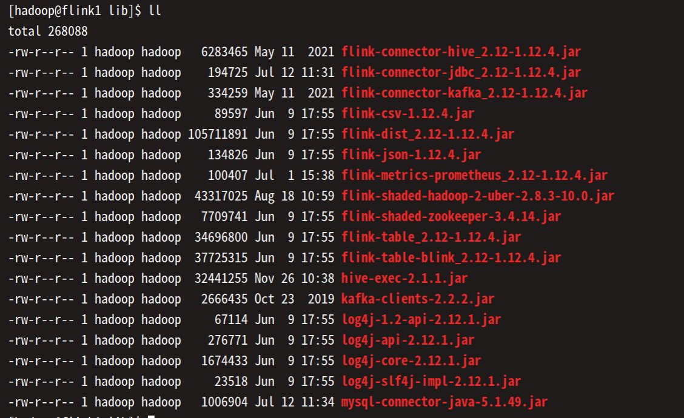

开发必读：

1、修改请先提issues，描述你的需求和思路，确定好之后，按照issue从master上拉分支。如issue-37-hive-connector。

2、新项目在分支的根目录上建文件夹，不用动其他文件夹里面的代码，以免merge时候出现冲突。

3、保证一个分支只解决一个问题，解决好后及时提交merge request并删除分支，便于commit回溯。

代码相关：

1、请使用flink1.12.4版本开发。

2、pom文件中不要引入无用的依赖，以及**flink已有的依赖**。

- 2.1、打包时候，不要把flink集群已有的jar包再次打入(除非像flink-connector-kafka中，由于自定义反序列化类而导致的报错)。
- 2.2、目前flink中已有的依赖jar包如下图
- 2.3、在打包时候，可以将flink已有的jar包加入<scope>provided</scope>，针对IDE无法找到provided中class类的问题，参考[链接](https://stackoverflow.com/questions/26167773/intellij-doesnt-add-maven-provided-scoped-dependencies-to-the-classpath)修改即可。

3、不要上传target等编译文件、iml、.idea等IDEA文件、以及日志文件等。

4、包名规范遵循：com.yzf.di.

5、Job名称使用英文、单词间使用空格，如octopus cdc from kafka to kudu，

上线相关：

1、上线jar包的时候，请将包名Myjar-1.0-SNAPSHOT-jar-with-dependencies.jar改为Myjar-c8bd5fefbde1dc5ae47159bf14a3e56686a3df04.jar，其中c8bd5fefbde1dc5ae47159bf14a3e56686a3df04为该项目最新的commit版本号。
这样便于回溯jar包版本，如Myjar-c8bd5fefbde1dc5ae47159bf14a3e56686a3df04.jar对应[链接](http://gitlab.yzf.net/group_di/bigdata/flink-job/commit/c8bd5fefbde1dc5ae47159bf14a3e56686a3df04)

