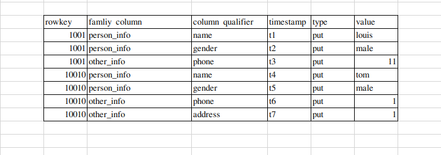
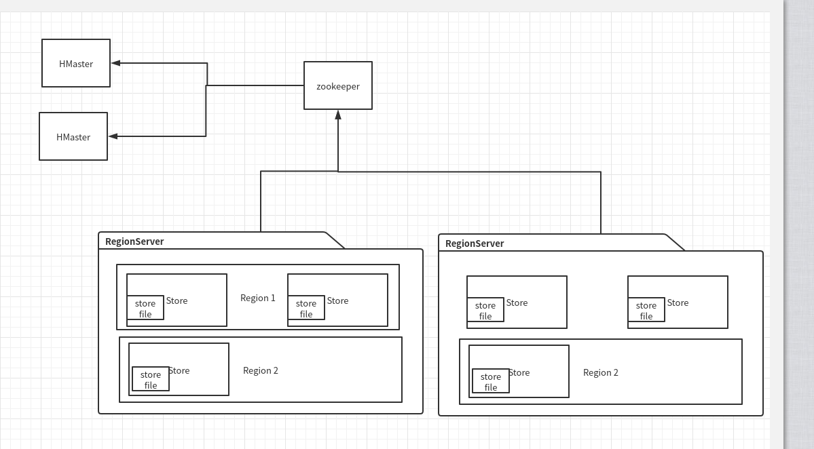
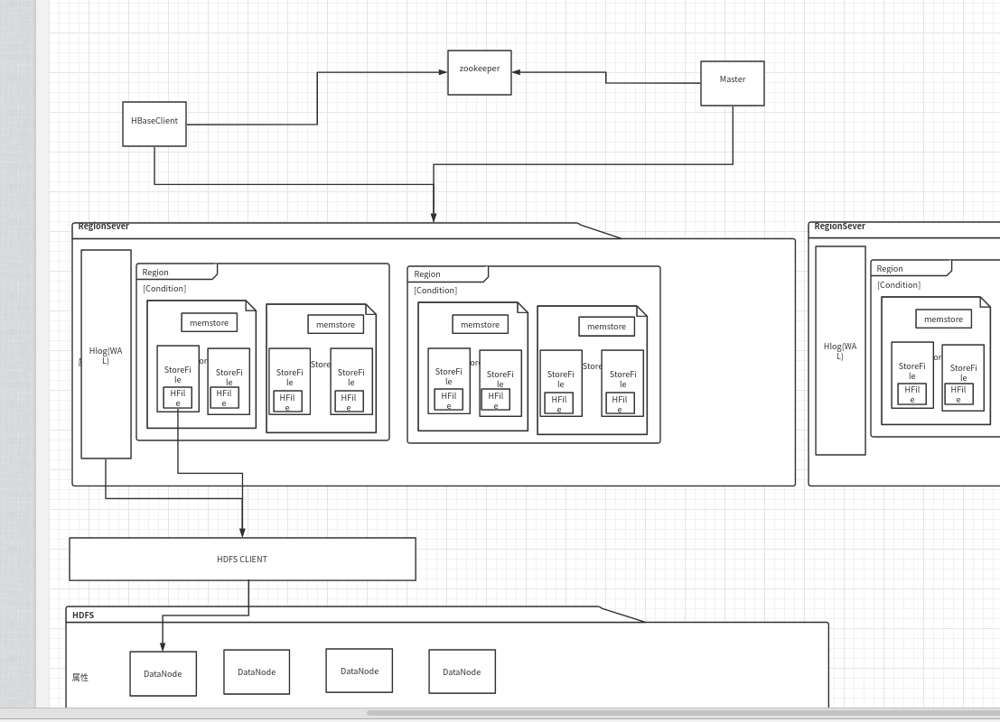
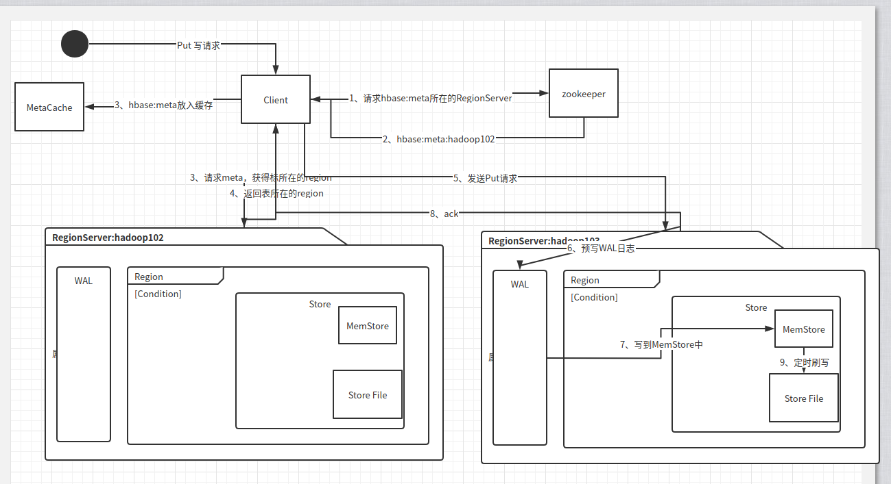
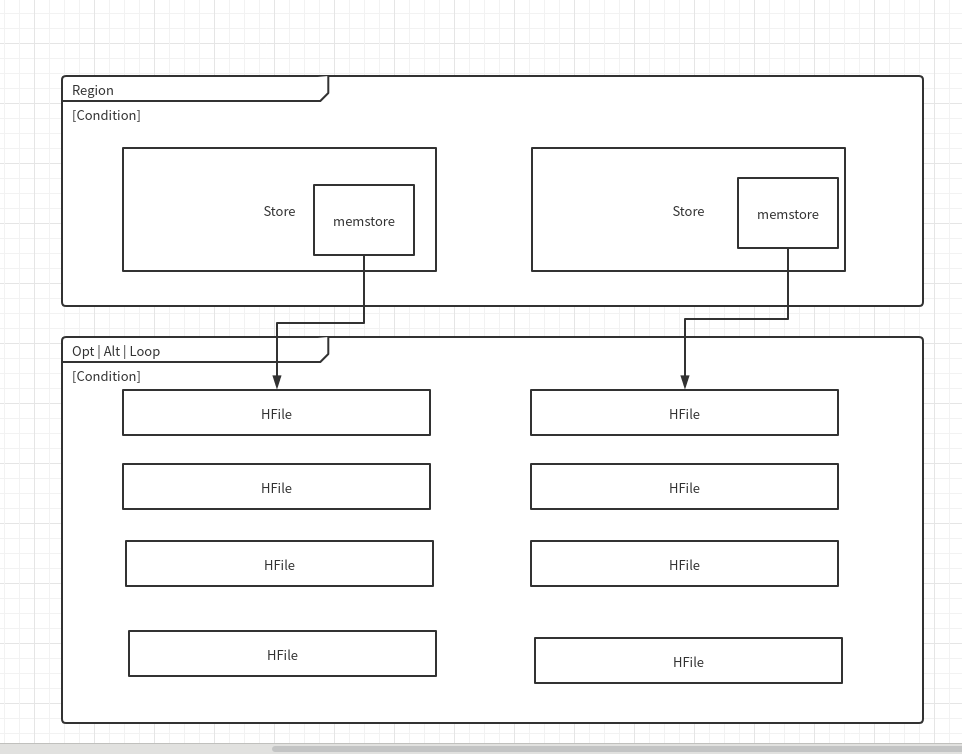
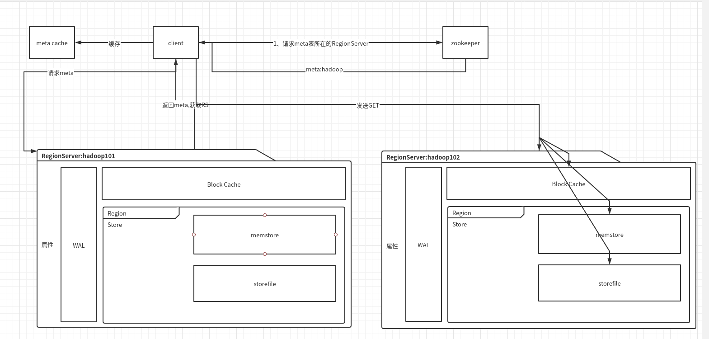
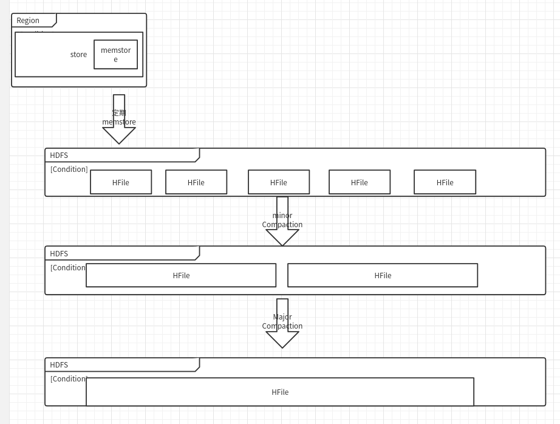

# 第一章、HBase简介

## 1.1 、HBase定义

​	HBase是一种分布式、可扩张、支持海量存储的NoSql数据库**。

## 1.2、HBase数据模型

​	逻辑上HBase和rdbms数据库很像，有行有列。

​	而在物理存储上，更像k-v的multi-dimensional map。

### 1.2.1、HBase逻辑模型


### 1.2.2、HBase物理存储结构



### 1.2.3、数据模型

#### 1、NameSpace

​	命名空间，类似于关系型数据库的DataBase概念，每个命名空间下有多个表。HBase有两个自带的命名空间。分别是hbase、default，hbase中存放的是hbase内置的表，default表是用户默认使用的命名空间。

#### 2、Region

​	类似于关系型数据库的概念，定义表的时候，定义**列族**即可。

#### 3、Row

​	HBase表中的每行都由一个Rowkey和多个Column组成。Rowkey有字典序存储。查询时候只能按照Rowkey进行检索，因此Rowkey的设计十分重要。

#### 4、Column

​	HBase中每个Column分为Column Family（列族）与Column Qualifier（列限定符）进行限定，如info:name,info:gender。

#### 5、TimeStamp

​	时间戳，用于标注数据的不同版本（version）， 每条数据写入时候，如果不指定时间戳，系统会自动为其加上时间戳字段，写入到HBase中。

#### 6、Cell

​	cell由{rowkey:column family:column quailify:timestamp}来指定唯一的Cell格。HBase主要存储稀疏矩阵，因此他的逻辑模型和物理存储模型是不一样的。


## 1.3、HBase基本架构（不完整版本）



架构角色，其中表存储在一个或多个Region中。一个CF存储在一个Store中。

### 1.3.1、Region Server

Region Server作为Region主要的管理者，实现类为HRegionServer，主要作用如下：

- 对于数据：put、get、delete
- 对于Region：主要合并、切分：splitRegion、compactRegion

### 1.3.2、Master

Master是所有RegionServer的主要管理者，实现类为HMaster，主要作用如下：

- 对于表的操作：create、delete、alter
- 对于RegionServer的操作：分配regions到每个RegionServer，监控每个RegionServer的状态，负载均衡与故障转移。

### 1.3.3、Zookeeper

- HBase通过Zookeeper来做到Master的高可用。
- RegionServer的监控。
- 元数据的入口。
- 集群配置的维护。

### 1.3.4、HDFS

- 底层存储


# 第二章、HBase快速入门

## 2.1、HBase安装部署

略

## 2.2、HBase Shell操作

### 2.2.1、基本操作

1、进入HBase客户端命令行。

```shell
./hbase shell
```

2、查看帮助

```shell
help
输出的帮助会按照 命令的类型进行分组，如ddl和dml
```


3、查看有哪些表

```shell
list
```


### 2.2.2、表的操作

1、create一个表

```shell
create 'stu','info1','info2'
// 创建info1、info2为列族的表stu
```


2、put数据

```shell
put 'stu','1001','info1:name','yck'
put 'stu','10010','info1:name','wsn',t1
```

3、scan扫描数据

```shell
scan 'stu'
scan 'stu',{LIMIT=>10}
scan 'stu',{STARTROW=>'1001',ENDROW=>'1002'}
```

4、查看表结构describe

```shell
describe 'stu'
```

5、更新指定字段的数据

```shell
put 'stu','1001','info1:name','yanck'
```


6、查看指定行的数据

```shell
get 'stu','1001'
get 'stu','1001','info1:name'
```

7、统计行数

```shell
count 'stu'
```

8、删除数据

```shell
delete 'stu','1001','info1:name'
deleteall 'stu','1001'
```

9、清空表

```shell
truncate 'stu'
```

10、删除表

```shell
disable 'stu'
drop 'stu'
```

11、变更表信息

```shell
alter 'stu',{NAME=>'info',VERSIONS=>3}
get 'stu2','1001',{COLUMN=>'info1:name',VERSIONS=>4}
```

​	HBase中的version版本号按照{rowkey:column family:column quailify:timestamp}中的timestamp来定义，本着FIFO的队列原则，当VERSIONS为3的时候，表示只保留三个版本的历史数据。

# 第三章、HBase进阶

## 3.1、架构原理




1、StoreFile

​	保存实际数据的物理文件，StoreFile以HFile的格式（如同Parquet等）存储在HDFS上。每个Store(对应ColumnFamliy)上有一个或多个StoreFile(HFile)，数据在每个StoreFile中都是有序（Rowkey的字典序？）的。

2、MemStore

​	写缓存，由于HFile中的数据要求是有序的，所以数据是先存储到memstore中，**排好序**后，等到**达到刷写时机**后刷写到HFile中，每次**刷写都形成一个新的HFile**。

3、WAL

​	由于数据要经MemStore排序后才能刷到HFile、但把数据保存到内存中有可能会导致数据丢失。为了解决这个问题，数据会先被写入到一个叫做Write-Ahead logfile的文件中，然后再写入到MemStore中。所以当系统出现故障时候，数据可以通过这个日志文件进行恢复。


高级知识点,TODO：

- [HFile刷写机制](http://hbasefly.com/tag/hlog/?syzqdi=iyj7s)

- HFile的LSM数据结构：

## 3.2、写原理



写流程

1、Client先访问zookeeper，获取hbase:meta表位于哪个RegionServer。

2-4、访问对应的RegionServer，获取hbase:meta表。根据结果中的namespace:table/rowkey（startrow-endrow）,判断出目标数据位于哪个RegionServer的哪个Region中。同时将table的region信息与meta表的位置信息缓存在客户端的meta cache中，便于下次访问。

5、向RegionServer发送put写请求。

6、将数据顺序写入（追加）到WAL中。滚动日志写入，按照顺序写。

7、将数据写入到对应的MemStore中，数据在MemStore中排序。

8、向客户端发送ack信息。

9、达到刷写时机之后，将数据刷写到HFile。


## 3.3、MemStore Flush



MemStore刷写时机：

1、当某个memstore的大小到达了hbase.hregion.memstore.flush.size（默认值128M），其**所在region的所有memstore**都会刷写。

当memstore的大小达到了hbase.hregion.memstore.flush.size(默认值128M)*hbase.hregion.memstore.block.multiplier(默认值4)时，会**阻止**继续向该memstore写数据。

2、当region server中memstore的总大小达到：

​	java_heapsize×hbase.regionserver.global.memstore.size（默认值4）×hbase.regionserver.global.memstore.size.lower.limit（默认值0.95）

​	region会按照其所有的大小顺序（由大到小）依次进行刷写。直到region server中所有memstore的总大小减小到上述值以下。

​	当region server中memstore的总大小达到

java_heapsize × hbase.regionserver.global.memstore.size（默认值0.4）时，会阻止继续往所有的memstore写数据。

3、达到自动刷写的时间，也会触发memstore flush。自动刷新的时间间隔有该属性进行配置：hbase.regionserver.optionalcacheflushinterval（默认一个小时）

4、当WAL文件数量超过hbase.regionserver.max.logs，region会按照时间顺序依次进行刷写，直到WAL文件数量减小到hbase.regionserver.max.log以下。

## 3.4、读流程

 

1、Client先访问zookeeper，获取hbase:meta表位于哪个RegionServer。

2、访问对应的RegionServer，获取hbase:meta表，根据读请求的namespace:table/rowkey，查询出目标数据位于哪个RegionServer的哪个Region中。并将该table的region信息以meta表的位置信息缓存在客户端的meta cache中，方便下次访问。

3、与Region Server进行通讯。

4、分别在Block Cache、MemStore、StoreFile中查询目标，并将查到的所有数据进行合并，此处所有数据是指同一条数据的不同版本或者不同的类型，因为有时间戳。

5、将从文件中查询的数据块（Block，HFile数据存储单元）缓存到Block Cache，为了更快。

6、将合并后的最终结果返回给客户端。

## 3.5、StoreFile Compaction

​	由于memstore每次刷写都会生成一个新的HFile，且同一个字段的不同版本（timestmap）和不同类型（Put/Delete）有可能分布在不同的HFile中。因此查询时候需要遍历所有的HFile。为了减少HFile的个数，以及清理过期和删除的数据，会进行StoreFile Compaction。

​	Compaction分为两种，分别是Minor Compaction（compact命令）和Major Compaction（major_compact命令）。

​	Minor Compaction会将接近的、若干较小的HFile合并为一个较大的HFile，但不会清理过期和删除的数据。

​	体现在compact命令上，会表现出如果当前列族的Store下的HFile大于三3个（hbase.hstore.compactionThreshold），也就是memstore刷了3次，会触发一次minor compaction。如果使用compact则手动触发合并。

​	Major Compaction会将一个Store下的所有HFile合并为一个大HFile，并**清理掉过期和删除**的数据。hbase.hregion.majorcompaction生产上建议为0,防止有较大的抖动。



## 3.6、Region Split

​	默认情况下，每个Table起初只有一个Region，随着数据的不断写入，Region会自动进行拆分。刚拆分时，两个子Region都位于当前的Region Server，但处于负载均衡的考虑，**HMaster有可能会将某个Region转移给其他的Region Server**。

​	Region Split的时机：

​    1、老版本：当1个Region中的某个Store下所有StoreFile的总大小超过**hbase.hregion.max.filesize**，默认10个G，该Region就会进行拆分。一分为二

​	2、新版本0.94以后：当1个Region中的某个Store下的所有StoreFile的总大小超过Min(R^2 * "hbase.hregion.memstore.flush.size",hbase.hregion.max.filesize)，该Region就会进行切分，其中R为当前Region Server中属于该Table的个数。


# 第四章、HBase API

## 4.1、环境准备

HBase的

https://docs.cloudera.com/cdp-private-cloud-base/7.1.3/accessing-hbase/topics/hbase-use-the-java-api.html


## 4.2、HBase API

HBase与Spring集成，采用spring-boot hadoop技术栈，官方文档中为xml的方式，这个是通过注解方式进行配置：

https://www.jianshu.com/p/16e9894f5035


## 4.3、MapReduce集成

说明：这个部分涉及MapReduce相关的东西，由于还没有系统学习hadoop，因此先不记录笔记了。

## 4.4、Hive集成

说明：这个部分涉及Hive外部表的创建，也先不记录笔记了。


# 第五章、HBase优化

## 5.1、高可用

说明：这部分内容一般使用CDH或者EMR进行统一管理。

## 5.2、预分区

每一个region维护一个StartRow与一个EndRow，如果加入的数据符合某个Region维护的Rowkey范围，则数据交给这个Region进行维护。因此有了预分区的概念，将预分区大致规划好，就能知道某个Rowkey落在哪个分区里面。

预分区有如下几种方法：

1、手动预先分区

```shell
> create 'staff1','info','partition1',SPLITS => ['1000', '2000', '3000', '4000']
```

2、生成16进制序列预分区

```shell
> create 'staff2', 'info', 'partition2', {NUMREGIONS => 15, SPLITALGO => 'HexStringSplit'}
```

3、按照文件中配置的规则进行预分区

```shell
aaa
bbb
ccc
ddd
```

然后执行：

```shell
create 'staff3', 'partition3', SPLITS_FILES => 'splits.txt'
```


## 5.3、RowKey设计


## 5.4、内存优化

## 5.5、基础优化


# 第六章、HBase实战之谷粒微博


# 第七章、HBase与SpringBoot的集成


# HBase数据迁移到Hive

1、二级索引。不太适用，因为查询条件不会集中在几个。

2、T+1。使用Timestamp?

​	使用hive复制

You can create map hbase table into Hive as in below link

https://cwiki.apache.org/confluence/display/Hive/HBaseIntegration

  then use Export/Import feature to replicate data.

https://cwiki.apache.org/confluence/display/Hive/LanguageManual+ImportExport

3、NIFI


# N资料

关于HBase的书，HBase原理与实践，HBasePMC出品的书，在过完尚硅谷的教程、SpringBoot与HBase的集成之后，可以看这本书。

https://book.douban.com/subject/34819650/

Google的BigTable论文

https://research.google/pubs/pub27898/

https://storage.googleapis.com/pub-tools-public-publication-data/pdf/68a74a85e1662fe02ff3967497f31fda7f32225c.pdf


